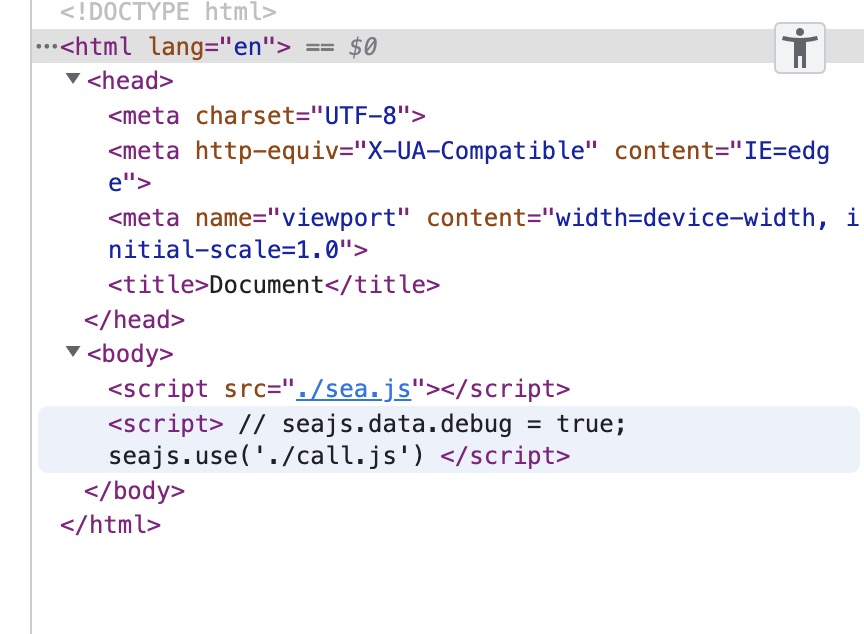

# 模块化发展史
主要分为IIFE、AMD、CMD、CommonJS、UMD、webpack（require.ensure）、ES Module `<script type="module"></script>`

为什么要模块化？

1. 避免变量污染
2. 复用代码
3. 隔离作用域

## IIFE
``` javascript
// 自执行函数，变量只在函数体内生效，隔离了作用域;互不影响
(function(win) {
  var a = 1
  win.test1A = a
})(window)

(function(win) {
  var a = 2
  win.test2A = a
})(window)
```

## requireJS AMD(Asynchronous Module Definition)
``` javascript
// main.js 注册模块的方法
requirejs.config({
  baseUrl: '',
  paths: {
    say: 'js/say',
  }
})
// 引用say方法
require(['say'], (say) => {
  say('hello');
});

// say.js 定义方法
define([''], function () {
  return (word) => {
    console.log(word)
  }
});
```
特点：

1. 依赖提前声明好
2. 比起IIFE更好维护，可寻踪方法是在哪个文件

核心原理：根据定义的工具(config方法传递的)的js文件地址，动态生成script加载对应js，得到其方法缓存到一个对象里以paths的name为key，等到require的时候找到这个方法
```javascript
// 用上面的demo举例就是
// 1. 动态生成script加载js/say
const script = documnet.createElemment('script').src = 'js/say.js'
document.head.append(script)
// 这个时候系统会去执行这个该js，也就是define(xxx)
var modules = {}
function define(deps, factory) {
  // deps是这个工具所依赖的其他工具，暂不用管
  modules.say = factory()
}
// require的时候
function require(deps, callback) {
  const id = deps.pop()
  // 根据id找到模块方法，并当作参数传出去
  callback(modules[id])
}
```

## seaJS CMD(Common Module Definition)
```javascript
// 定义配置文件但是不加载，只是把依赖通过闭包储存起来
// seajs.data.debug = true;
  seajs.use('./call.js')

// 使用
define(function(require, exports, module) {
  var jquery = require('todo')
  // doSomeThings
});

// todo.js声明
define(function(require, exports, module) {
  module.exports = (something) => {
    console.log(`do ${something}`)
  }
});
```

了解`module.exports`之前我们先来看一个demo
```javascript
// index.html 
<script src="./a.js"></script>
<script src="./b.js"></script>
<script>
  exportTest(myModule)
  console.log(myModule) // 输出 导出了一个字符串
</script>

// a.js
var myModule = {
  exports: {}
}

function define(factory) {
  factory(myModule);
}

// b.js
define((module) => {
  module.exports = '导出了一个字符串'
})
```
上面的例子是简易模仿`define`&`module.exports`
1. 调用函数传递参数，传递的是引用值(`reference value`)那么函数体内的到的就是引用，反之则是基本数据类型
2. 在函数体内修改了对象的某个属性，因为是引用类型所以其他地方也会改变
3. 函数是可以当作参数传递的（高阶函数）

正是通过上面的几个原理我们实现了一个最简易的`module.exports`&`define`这对我们理解下面的很有帮助

特点：

1. 使用时在进行创建script保存变量方法
2. 加载成功后从dom中删除该script，防止内存泄漏

与requireJS不同点
1. config的时候不加载js
2. js加载成功后保存方法，然后删除js防止内存泄漏

核心原理：use(xxx)的时候找到该文件，动态创建script插入head标签内部，然后删除该script（防止内存泄漏）；使用require的时候根据require(xxx)找到该文件，重复第二步，使函数方法保存在内存里；define的时候把定义的方法保存到module.exports里；




## node requireJS CommonJS
// 简单使用
```javascript
// index.js
const todo = require('./todo.js')
todo('eat') // eat
console.log(obj) // { a: 2 }

// todo.js
module.exports = (somethings) => console.log(somethings)

// todo2.js
var obj = {a: 1}
module.exports = obj
obj.a = 2
```

这里先抛出三个问题
1. require、module从哪来的？我们明明没有引用这个却能直接使用
2. 为什么第二个log会打印 `{a: 2}`，我把它引用出来的时候明明它还是1
3. `nodejs`没有`script`怎么执行js脚本?

`nodejs`只有一个入口，首先从package.json中找到`main`使用fs模块读取该入口文件成字符串

```javascript
// source 此时就是该文件的字符串源码
const source = fs.readFileSync('./index.js')
```

然后nodejs会使用上下文把它给包裹起来
```javascript
var wrapper = [
  '(function (exports, require, module, __filename, __dirname) { ',
  '\n});'
]

// 方便理解写成这样
// var wrapper = [
//   '(function(){',
//   // 这里放source
//   '})(global.exports, global.require, global.__filename, global.__dirname)'
// ]

// 组合成带环境的最终代码 可能就是这样的字符串
// (function(exports, require, module, __filename, __dirname) {
//   module.exports = (somethings) => {
//     console.log(somethings);
// }
// })(global.exports, global.require,global.module, global.__filename, global.__dirname);
const endSrouce = wrapper[0] + source + wrapper[1]
```

用当前上下文去执行，这样我们就能在js环境中拿到`require、module...`方法或变量了。其中nodejs用C语言封装了一个`ContextifyScript`,然后使用这个方法new出来一个实例，去运行

```javascript
// 5.x版本
// 这个是C封装的，看球不懂，大概理解意思就行
var script = new ContextifyScript(source)
script.runinThisContext()
```

也就是说会先执行一边引用的文件才给缓存起来，这就解释了为什么打印`{a: 2}`

总结
1. AMD&CMD核心原理是利用动态创建script，然后放入html中执行该脚本；使用闭包保存方法、变量
2. nodejs的commonjs是使用C语言执行js代码，注入上下文执行js
3. module.export 导出是利用函数的传参数的引用类型

后续：umd esmodule
