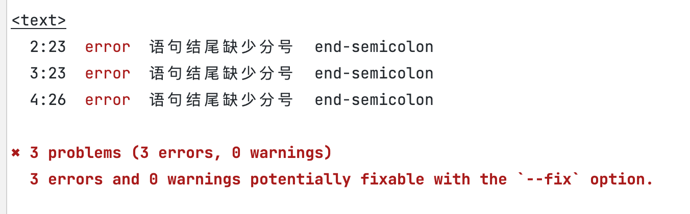
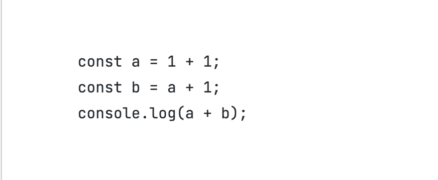

## 自定义一个eslint

> 背景

本次分享的一个背景就是之前一直只是大致了解eslint的原理，但是没有去真正实现过一个自定义的eslint。

> 目标

1. 了解为什么要用eslint和为什么要学习如何实现一个eslint
2. 实现一个eslint以及学习eslint的部分api
3. 学会在项目中对配置eslint拦截提交，在提交时统一eslint规范

思考几个个问题？

1. 多人负责开发的项目，每个人写代码的风格都不一样（是否加分号、括号内是否有空格等等），有的人写的代码整洁而有的人写的代码是一坨代码没有格式
2. 在项目中因为某些小问题导致出过很多次线上问题，如何避免（a.b.c/解构赋值null）
3. 如何统一规范，每个人的习惯难以修改

应该每个人都多多少少遇到过上面的几个问题，使用eslint就可以轻松解决上面的几个问题
增加格式校验、提交时自动格式化、容易犯错的写法增加自定义eslint拦截

### 简单实现一个eslint插件
下面我们看一个检查语句结尾是否有分号的lint

#### 安装

首先我们先安装eslint

> npm i eslint / yarn add eslint

安装完成之后我们创建一个end-semicolon.js的文件(名字随意)，用来实现检查结尾是否有分号的eslint
注意文件名就是我们要配置的rule

```javascript
// end-semicolon.js
const lookHasSemicolonAtEnd = (str) => str === ';'

module.exports = {
    meta: {
        description: '这是一个检测语句结尾有没有分号的lint', // 描述
        fixable: 'code', // 如果没有配置这个，即使实现了fixable，eslint也不会修正代码
        messages: {
            'endNotSemicolon': '语句结尾缺少分号' // lint错误提示
        }
    },
    create(context) {
        // 获取ast语法树
        const sourceCode = context.getSourceCode()
        return {
            VariableDeclaration(node) { // 声明语句处理
                // 获取该node的最后一个token
                const lastToken = sourceCode.getLastToken(node)
                if (!lookHasSemicolonAtEnd(lastToken.value)) {
                    // 报告错误
                    context.report({
                        node: node,
                        loc: lastToken.loc,
                        messageId: 'endNotSemicolon', // meta里配置的元信息
                        fix: function (fixer) {
                            // 循序修复的话，会调用修复方法
                            return fixer.insertTextAfter(node, ';')
                        }
                    })
                }
            },
            ExpressionStatement(node) { // 表达式语句处理
                const lastToken = sourceCode.getLastToken(node)
                if (!lookHasSemicolonAtEnd(lastToken.value)) {
                    context.report({
                        node: node,
                        loc: lastToken.loc,
                        messageId: 'endNotSemicolon',
                        fix: function (fixer) {
                            return fixer.insertTextAfter(node, ';')
                        }
                    })
                }
            }
        }
    }
}
```

具体的配置可以参考官方文档：

[参考文档 eslint](https://eslint.bootcss.com/docs/developer-guide/working-with-rules)

经过上面的步骤，我们的eslint已经写好了，那接下来我们看下如何使用

#### 使用eslint api

我们在同级的目录下新建一个index.js，代码如下：

```javascript
const eslint = require('eslint')

const lint = new eslint.ESLint({
    // 是否自动修复
    fix: false,
    overrideConfig: {
        parserOptions: { // 解析配置
            ecmaVersion: 6, // 使用es6
        },
        rules: {
            // 自定义的lint，名字根文件名一致，等级是error
            'end-semicolon': ['error']
        }
    },
    // lint的目录
    rulePaths: [__dirname],
    // 不使用eslintrc
    useEslintrc: false
})

// 测试函数
async function run() {
    const result = await lint.lintText(`
        const a = 1 + 1
        const b = a + 1
        console.log(a + b)
    `)
    const formatter = lint.loadFormatter('stylish')
    const resultText = (await formatter).format(result)
    console.log(resultText)
    console.log(result[0].output)
}

run()

```
我们执行 `node index`应该能看到下面的报错截图



我们看下把fix参数改为true之后的效果



可以看到没有分号结尾的语句自动给加上分号了。

这样我们就实现了一个简单地eslint规则

#### husky

husky可以约束你的提交message、约束code等等，可以使我们代码提交前检查代码、检查我们的
commit message


