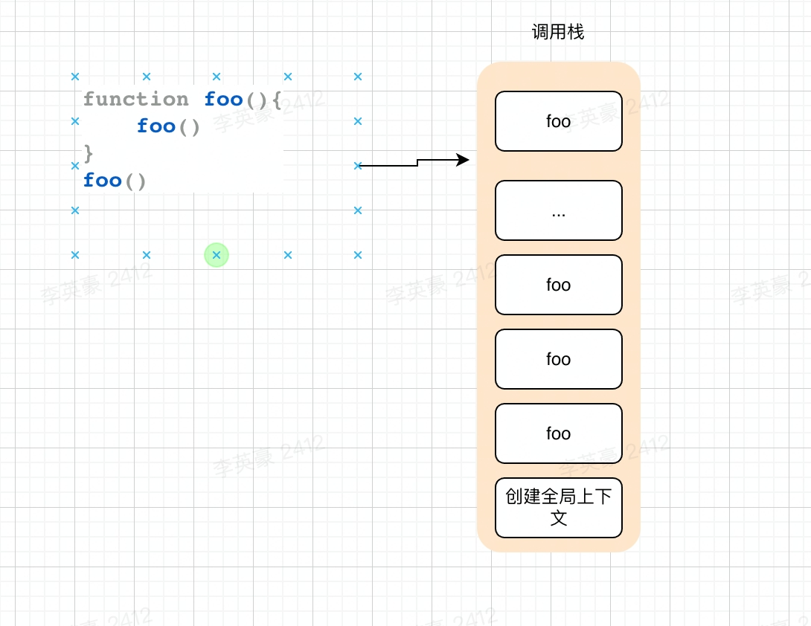
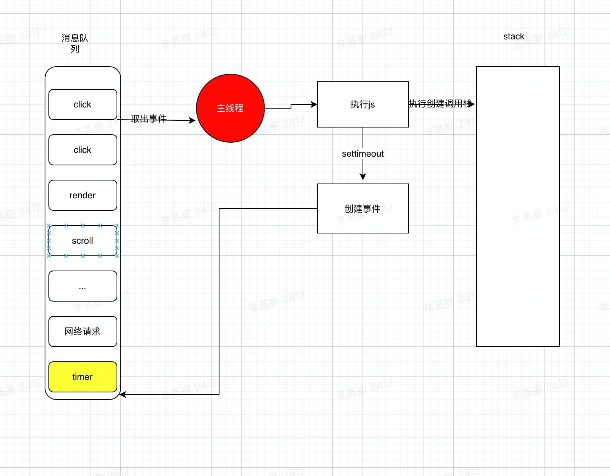
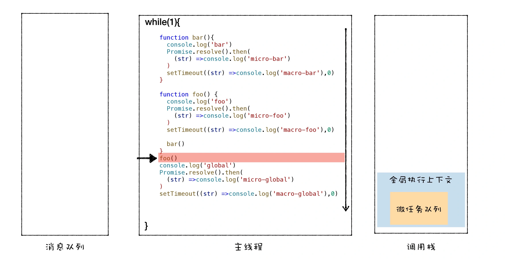
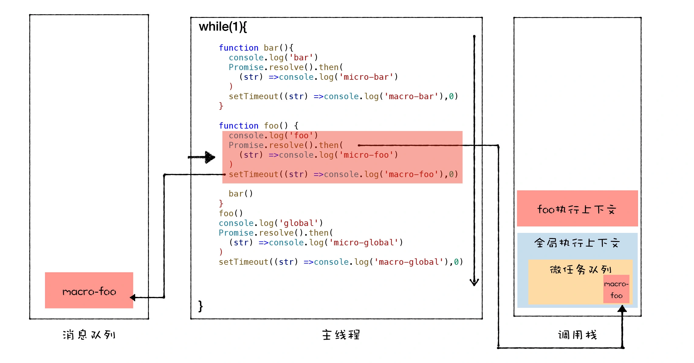
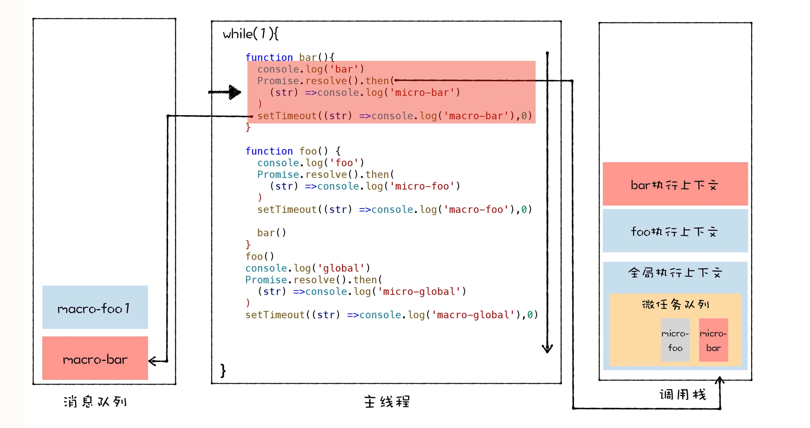
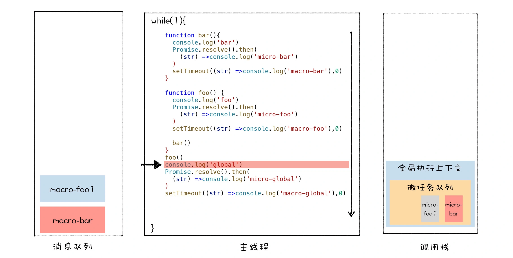
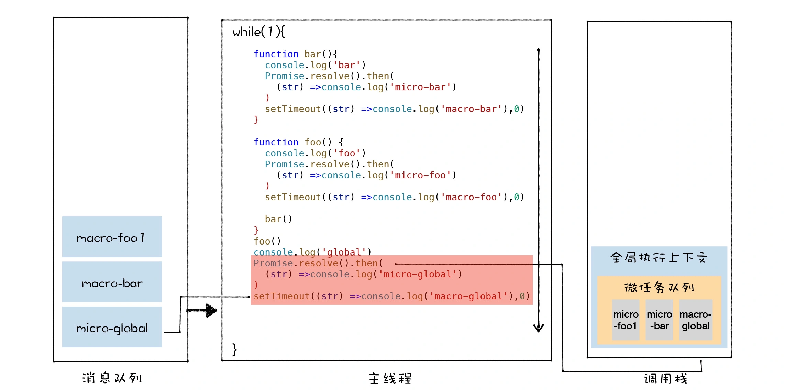

## v8 事件循环（event loop）
提到事件循环我们就不得不说js中的函数、回调函数、异步回调函数、promise、generator、async/await，这些常用回调函数以及 消息队列、micro、macro、主线程，我们会在下面一一说到

我们在使用`javascript`写代码的难免会使用到回调函数。同步回调函数`Array.map`、`Array.filter`对数组进行一些操作；异步回调函数比如我们用到的网络请求 `XMLHttpRequest`请求后端接口、请求静态资源等，`NodeJs`中的`fs`系统对文件进行一些异步操作

> 目标

1. 了解event loop帮助我们解决面试中的一些笔试题
2. 帮助我们解决工作中的一些难题
3. ...
   
### 回调函数
> 什么是回调函数？

简单来说回调函数也是函数，只不过在`Javascript`中函数作为一等公民，可以作为参数传递给另一个函数，被另一个函数所调用。

> 同步回调

```javascript
const arr = ['同步', '数组', '调用']

function forEach(array, callback) {
    for (let i = 0; i < array.length; i++) {
        callback(array[i], i, array)
    }
}

const callback = (...args) => {
    console.log('同步回调执行', ...args)
}
forEach(arr, callback)
console.log('证明callback是在函数内部调用的')
```

同步回调函数，也就是回调函数在调用函数内部被执行，比如上面代码

1. 创建全局上下文并入栈
2. 执行forEach函数并推入栈中
3. 每次for循环都会执行callback入栈，callback执行完都会出栈
4. forEach出栈

> 异步回调

```javascript
function test() {
    setTimeout(function () {
        console.log('异步回调任务')
    }, 2000)
    console.log('证明异步是在函数外被调用的')
}
test()
```
异步回调函数，回调函数不会在调用函数内部执行，`setTimeout`会创建一个事件，放入事件队列中，由主线程一个一个去拿来执行

1. 创建全局上下文入栈
2. 执行test函数，并并使test函数入栈
3. setTimeout创建事件放入消息队列
4. test函数出栈
5. 主线程不断从消息队列取出事件进行执行，最终执行到setTimeout创建的事件，异步回调被执行

### 栈和队列
栈和队列是两种常用的数据结构

> 栈

栈的特点是先进后出（FILO），常用的就是js中的函数调用栈、数组上的方法

```javascript
const stack = [1, 2, 3]
// push方法是一个典型的入栈，在尾部追加一个数据
stack.push(4) // [1, 2, 3, 4]

// pop方法是一个典型的出栈，从尾部弹出一个数据
stack.pop() // [1, 2, 3]
```

> 队列

队列（queue）这个概念就比较好理解，它的特点是先进先出(FIFO)，就像我们平时排队一样。队列在我们js中也是常用的，消息队列、广度优先遍历、数组

```javascript
const queue = [1, 2, 3]
// push方法是一个典型的入栈，在尾部追加一个数据
queue.unshift(4) // [4, 1, 2, 3]

// pop方法是一个典型的出栈，从尾部弹出一个数据
queue.pop() // [4, 1, 2]
```

经过上面的概念，我们了解了栈和队列的基本概念，我们思考下面例子

例一
```javascript
function foo(){
    foo()
}
foo()
```

例二
```javascript
function foo(){
    setTimeout(foo, 0)
}
foo()
```
在第一个例子中由于栈内存得不到释放必然会得到页面卡死/栈爆炸的报错的现象



第二个例子因为setTimeout会创建事件到消息队列，所以能够解决一部分栈溢出的问题，但是由于setTimeout并不能精准的按时执行


```javascript
function foo(){
    const startTimeStamp = Date.now()
    setTimeout(function () {
        console.log('foo 执行', Date.now() - startTimeStamp)
        foo()
    }, 0)
    let i = 0
    while (i < 100000000) {
        i++
    }
}

foo()
```
因为主线程需要从执行完当前任务才回去消息队列取出新的任务去执行的，所以如果当前任务阻塞（如上），它的执行时机就不准确，而且在不活跃的tab中setTimeout的延时大概是1000，因此我们想要精准的控制执行顺序，就需要微任务

### 微任务&宏任务

> 宏任务

类似于`setTimeout`、`click`这些事件都是宏任务，他们都会创建事件然后放到消息队列，在主线程执行完当前代码时去消息队列取

> 微任务

`Promise`、`MutationObserver`等这些都是微任务，那么微任务是怎么执行的？

```javascript
function bar(){
  console.log('bar')
  Promise.resolve().then(
    (str) =>console.log('micro-bar')
  ) 
  setTimeout((str) =>console.log('macro-bar'),0)
}

function foo() {
  console.log('foo')
  Promise.resolve().then(
    (str) =>console.log('micro-foo')
  ) 
  setTimeout((str) =>console.log('macro-foo'),0)
  
  bar()
}
foo()
console.log('global')
Promise.resolve().then(
  (str) =>console.log('micro-global')
) 
setTimeout((str) =>console.log('macro-global'),0)
// 输出顺序
// foo
// bar
// global
// micro-foo
// micro-bar
// micro-global
// macro-foo
// macro-bar
// macro-global
```
浏览器在执行上面代码时会创建一个全局上下文压入栈底，同时创建一个微任务队列,当当前任务执行完乘之后，会再micro队列中按顺序取出微任务，去执行







`MutationObserver`实现了对dom的监听，那么它是如何实现的？

微任务(promise)能够让我们精细化的控制任务同时也解决了回调地狱的问题

### async/await
`Javascript`在`es7`引入了`async/await`使我们的代码逻辑处理起来更加的线性，他在不阻塞主线程的情况下使用同步代码进行资源访问

```javascript
async function test() {
    try {
        const id = await getId()
        const name = await getName(id)
        console.log(name)
    } catch (e) {
        console.log('请求出错')
    }
}

function getName(id) {
    return new Promise((resolve) => setTimeout(() => {resolve('thankslyh')}, 2000))
}

function getId() {
    return new Promise((resolve) => setTimeout(() => {resolve('lyh')}, 2000))
}
```

那么我们先来看看async是什么

`MDN`定义`async`关键字返回的是一个`promise`，这个 promise 要么会通过一个由 async 函数返回的值被解决，要么会通过一个从 async 函数中抛出的（或其中没有被捕获到的）异常被拒绝。这句话的意思是什么呢？我们看下面例子

> async

```javascript
async function testAsync() {
    return 1
}

const testAsyncResult = testAsync()
```

也就是说`async`后的函数会被自动转为`promise`函数，函数的返回值就是该函数被解决的返回值

> await

```javascript
async function run() {
    const data = await test()
    console.log(data) // 1
}

function test() {
    return 1
}

run()
```

`await`后面跟的函数也会被默认转为promise，并且return值就是promise被resolve返回值；如果跟的就是一个promise，得到的值就是该promise resolve后的值。await只能在async内部使用，否则会报语法错误

[https://developer.mozilla.org/zh-CN/docs/Web/JavaScript/Reference/Statements/async_function](https://developer.mozilla.org/zh-CN/docs/Web/JavaScript/Reference/Statements/async_function)

> 区别
1. `callback`回调函数形式异步编程模型需要我们写大量的回调函数，大量的回调函数其实会打乱代码的原有顺序，让代码读起来不够线性
2. `promise`链式调用能很好解决回调地狱的问题但是充满的.then的链式调用，代码不能准确表示执行流程
3. `async/await`同步的形式实现异步调用，让我们的代码更加的线性，但是需要注意的是由于每个await后的代码都要等之前的代码执行完才会执行，会使代码进行阻塞，所以要合理使用

### 总结

1. 浏览器有一个UI主线程，不断从消息队列取出任务执行（消息事件队列、timer消息队列等）
2. 取出该任务之后会会创建一个空的js调用栈（js call stack）
3. 由V8虚拟机编译代码（JIT）执行，创建一些必要的环境入栈（全局上下文、宿主环境）
4. 执行代码入栈先进后出，遇到宏任务时会创建事件放入消息队列，遇到微任务时会放到该宏任务的微任务队列

