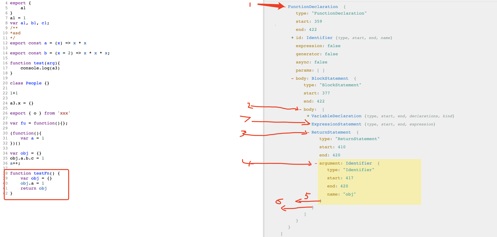

## 什么是 Tree Shaking

Tree Shaking 又叫摇树机制，顾名思义就是通过摇树把枯萎的无用的树叶给摇下来。
在我们的代码中就是通过“摇”把无用的代码去掉，是优化的一个范畴

> 为什么学习 Tree Shaking

1. 合理的运用 tree shaking 机制能够使我们代码打包时降低包的大小，优化加载速度
2. 最近几年的面试中`Tree Shaking`被问到的比较多，能够帮助我们面试

> 目标 (rollup)

1. 知道怎么合理的使用`Tree Shaking`
2. 了解`Tree Shaking`的核心原理(本次只是先了解一些基本概念)

> 为什么是 rollup？

1. rollup 是最早实现 tree shaking 的编译工具，并且我们的目标就是了解 tree shaking
2. rollup 在最早期 0.20.0 版本代码还相对较少，方便读

## DCE （Dead Code Elimination）死码清除

`DCE`和`Tree-shaking`的终极目标是一致的，就是为了减少无用的代码被打包，但它们存在区别

`rollup`的作者`Rich Haris`举了个蛋糕的例子：

指出 DCE 就好比在做蛋糕的时候直接把鸡蛋放入搅拌，最后在做好的蛋糕中取出蛋壳，这是不完美的做法，而 Tree-shaking 则是在做蛋糕的时候只放入我想要的东西，即不会把蛋壳放入搅拌制作蛋糕

[参考文章](https://segmentfault.com/a/1190000040476979)

> 什么是 Dead Code

```javascript
// 声明了变量或函数却没有使用
const a = 1
-------------------
// 引入了某个变量没有使用
import { a } from 'xxx'

// 导出的包里有纯函数调用
export const add => x => x + x

add(1)

// 永远都不会被执行的逻辑
if (false) {
  console.log('永远都不会到达的逻辑')
}
```

这一类没有被使用/不会被执行的代码就叫做死码，这一类代码不需要被打包进去，这个时候`webpack/rollup`就会使用摇树机制清除死码

接下来我们先了解一些`rollup`中基本库

## MagicString 类

```javascript
var magicString = new MagicString('export var name = "beijing"');
//类似于截取字符串
console.log(magicString.snip(0, 6).toString()); // export

//从开始到结束删除字符串(索引永远是基于原始的字符串，而非改变后的)
console.log(magicString.remove(0, 7).toString()); // var name = "beijing"

//很多模块，把它们打包在一个文件里，需要把很多文件的源代码合并在一起
let bundleString = new MagicString.Bundle();
bundleString.addSource({
  content: "var a = 1;",
  separator: "\n",
});
bundleString.addSource({
  content: "var b = 2;",
  separator: "\n",
});
/* let str = '';
str += 'var a = 1;\n'
str += 'var b = 2;\n'
console.log(str); */
console.log(bundleString.toString());
// var a = 1;
//var b = 2;
```

## AST 抽象语法树

把`js`代码转换为`ast`语法树，方便操作树，一般 webpack 和 rollup 都是用 acorn 去解析 ast 语法树

```json
// import { cube } from 'math'
{
  "type": "Program",
  "start": 0,
  "end": 27,
  "body": [
    {
      "type": "ImportDeclaration",
      "start": 0,
      "end": 27,
      "specifiers": [
        {
          "type": "ImportSpecifier",
          "start": 9,
          "end": 13,
          "imported": {
            "type": "Identifier",
            "start": 9,
            "end": 13,
            "name": "cube"
          },
          "local": {
            "type": "Identifier",
            "start": 9,
            "end": 13,
            "name": "cube"
          }
        }
      ],
      "source": {
        "type": "Literal",
        "start": 21,
        "end": 27,
        "value": "math",
        "raw": "'math'"
      }
    }
  ],
  "sourceType": "module"
}
```

ast 在线转换 [https://astexplorer.net/](https://astexplorer.net/)

1. ast 语法树解析，每个文件是一个`Program`
2. body 里存放的所有完整的语句`var a = 1;`

> export 语句

```json
// export const a = (x) => x * x;
{
  "type": "ExportNamedDeclaration",
  "start": 45,
  "end": 75,
  "declaration": {
    "type": "VariableDeclaration",
    "start": 52,
    "end": 75,
    "declarations": [
      {
        "type": "VariableDeclarator",
        "start": 58,
        "end": 74,
        "id": {
          "type": "Identifier",
          "start": 58,
          "end": 59,
          "name": "a"
        },
        "init": {
          "type": "ArrowFunctionExpression",
          "start": 62,
          "end": 74,
          "id": null,
          "expression": true,
          "generator": false,
          "async": false,
          "params": [
            {
              "type": "Identifier",
              "start": 63,
              "end": 64,
              "name": "x"
            }
          ],
          "body": {
            "type": "BinaryExpression",
            "start": 69,
            "end": 74,
            "left": {
              "type": "Identifier",
              "start": 69,
              "end": 70,
              "name": "x"
            },
            "operator": "*",
            "right": {
              "type": "Identifier",
              "start": 73,
              "end": 74,
              "name": "x"
            }
          }
        }
      }
    ],
    "kind": "const"
  },
  "specifiers": [],
  "source": null
}
```

`export`语句是有`declaration`声明的，里面存放导出的属性声明

...

## walk 递归遍历 ast 语法树

```javascript
// walk函数
function visit(node, parent, enter, leave, prop, index) {
  if (!node) return;

  if (enter) {
    context.shouldSkip = false;
    enter.call(context, node, parent, prop, index);
    if (context.shouldSkip) return;
  }
  // {}
  var keys = (childKeys[node.type] = Object.keys(node).filter(function (key) {
    return typeof node[key] === "object";
  }));

  var key, value, i, j;

  i = keys.length;
  // 从后往前遍历key
  while (i--) {
    key = keys[i];
    value = node[key];
    // 如果该属性的value是数组，就从后往前遍历该数组
    if (isArray(value)) {
      j = value.length;
      while (j--) {
        visit(value[j], node, enter, leave, key, j);
      }
    } else if (value && value.type) {
      visit(value, node, enter, leave, key, null);
    }
  }

  if (leave) {
    leave(node, parent, prop, index);
  }
}
function walk(ast, ref) {
  var enter = ref.enter;
  var leave = ref.leave;

  visit(ast, null, enter, leave);
}
```

`rollup`遍历遍历语句/词法是从后往前递归遍历，也就是会先遍历后面的语句和词法



## Tree Shaking 原理

1. ES6 的模块引入是静态分析的，故而可以在编译时正确判断到底加载了什么代码
2. 分析程序流，判断哪些变量未被使用、引用，进而删除此代码。

> 为什么是静态分析？为什么是 es6 而不是 commonjs（抛开 import()），import 为什么必须在顶部

```javascript
if (isLoad) {
  import a from "b"; // 报错
}
```

首先 import 不支持在条件语句里引入的（import(xxx)不算），因为 esModule 语法在经过`ast`编译的时候是静态的，也就是说在编译的时候没有办法知道`isLoad`是否为 true，`commonjs`的`require`是可以在条件语句内加载的，故不支持`tree shaking`

## 入口

我们先找到`rollup`入口文件

```javascript
export function rollup(options) {
  // 创建bundle，每一个入口是一个bundle
  const bundle = new Bundle(options);
  // 执行build方法
  return bundle.build();
}
```

接下来我们逐步去分析`Bundle`这个类

## Bundle

```javascript
export default class Bundle {
	constructor ( options ) {
		this.entry = options.entry;
		// 保存entryModule也就是entry对应的文件生成的module
		this.entryModule = null;

		this.plugins = ensureArray( options.plugins );
		// 根据路径找到文件的方法
		this.resolveId = first(
			this.plugins
				.map( plugin => plugin.resolveId )
				.filter( Boolean )
				.concat( resolveId )
		);
		// 根据文件路径找读取文件内容
		this.load = first(
			this.plugins
				.map( plugin => plugin.load )
				.filter( Boolean )
				.concat( load )
		);
		// 允许用户定制化一些转换代码规则
		this.transformers = this.plugins
			.map( plugin => plugin.transform )
			.filter( Boolean );
        // 正在创建中的一些模块，避免循环
		this.pending = blank();
		// 通过id获取module
		this.moduleById = blank();
		// 存放所有的module
		this.modules = [];
	}
    // 打包
	build () {
		return Promise.resolve( this.resolveId( this.entry, undefined ) ) // 根据入口用过获取到source code`import {a} from 'b'`
			.then( id => this.fetchModule( id, undefined ) )
            // 入口文件对应的module
			.then( entryModule => {
				//...
			});
	}

	deconflict () {...}

	fetchModule ( id, importer ) {
		// short-circuit cycles
		// 如果该模块正在记载直接返回，目的是为了避免循环
		if ( this.pending[ id ] ) return null;
		this.pending[ id ] = true;
		// 读取源代码 source code
		return Promise.resolve( this.load( id ) )
			// 先经过使用者自定义的转换器进行一次转换
			.then( source => transform( source, id, this.transformers ) )
			.then( source => {
				const { code, originalCode, ast, sourceMapChain } = source;
                // 创建入口文件的module
				const module = new Module({ id, code, originalCode, ast, sourceMapChain, bundle: this });

				this.modules.push( module );
				this.moduleById[ id ] = module;

				return this.fetchAllDependencies( module ).then( () => module );
			});
	}
    // 获取module所依赖的所有module
    // 也就是该模块 `import xxx from 'xxx'`引入的内容
	fetchAllDependencies ( module ) {...}
    // 输出处理后的source code
	render ( options = {} ) {...}

	sort () {...}
}
```

经过上面`Bundle`文件我们可以大概了解`bundle`做了哪些事情

1. 创建`bundle并`调用 `build`方法，得到`entryModule`
2. 根据入口文件名称调用`fetchModule`方法获取到文件的 `source code`
3. 调用用户自定义传入的 `transfrom`方法转换`source code`,如果没传则不处理
4. 把创建出来的 `module`放入自身的`this.modules`和`this.moduleById`里，方便之后使用
5. 加载当前 `module`所依赖的全部依赖

还有其他的一些方法，由于现在还没有流转到，所以这里先不说。那我们接下来去看这个 `Module`类做了什么

## Module

```javascript
export default class Module {
	constructor ({ id, code, originalCode, ast = null, sourceMapChain, bundle }) {
		// 当前被用户转换后的代码
		this.code = code;
		// 源码，也就是直接被读取到的字符串
		this.originalCode = originalCode;
		this.sourceMapChain = sourceMapChain;
		// 保存父bundle，也就是把module对应上父bundle,方便直接使用
		this.bundle = bundle;
		this.id = id;

		// 该module所依赖的所有属性/方法
		this.dependencies = [];
		this.resolvedIds = blank();

		// 该模块引用的依赖 `import a from 'b'`
		this.imports = blank();
		// 该模块导出的依赖 `export const foo = 1`
		this.exports = blank();
		// 该模块从其他模块导出的依赖 `export foo from 'b'`
		this.reexports = blank();
		// 给该文件创建magicString，方便进行删除、新增等操作
		this.magicString = new MagicString( code, {
			filename: id,
			indentExclusionRanges: []
		});

		// 解析语法树转换为表达式
		this.statements = this.parse( ast );
		// 该模块所有的声明
		this.declarations = blank();
		// 分析模块
		this.analyse();
	}
	// 当前语句是导出语句，就把该语句添加到dependencies和exports里reexports
	addExport ( statement ) {...}
	// 当前语句是导入语句，就把该语句添加到dependencies和imports里
	addImport ( statement ) {...}
	// 模块分析方法
	analyse () {
		// discover this module's imports and exports
		this.statements.forEach( statement => {
			// 是import/export表达式，就分别把该表达式放入对应的数组中
      // 目的是为了标记模块依赖的模块位置
      // 也就是说index 模块引用的cube对应的文件名
			// math模块导出的变量对应的位置
			if ( statement.isImportDeclaration ) this.addImport( statement );
			else if ( statement.isExportDeclaration ) this.addExport( statement );
			// 分析语句
			statement.analyse();

			statement.scope.eachDeclaration( ( name, declaration ) => {
				this.declarations[ name ] = declaration;
			});
		});
	}

	basename () {}
	// 绑定别名
	bindAliases () {...}
	// 绑定引用，也就是该模块依赖于其他模块的变量/方法
	bindReferences () {...}

	// 处理强弱依赖，如果该引用是被立即使用的就是强依赖
	consolidateDependencies () {...}
	// 获取该模块的导出的变量
	getExports () {...}
	// 标记副作用
	markAllSideEffects () {
		let hasSideEffect = false;

		this.statements.forEach( statement => {
			if ( statement.markSideEffect() ) hasSideEffect = true;
		});

		return hasSideEffect;
	}
	// 命名空间
	namespace () {...}

	parse ( ast ) {
		// The ast can be supplied programmatically (but usually won't be)
		// 允许提供ast（但通常不会）
		if ( !ast ) {
			// Try to extract a list of top-level statements/declarations. If
			// the parse fails, attach file info and abort
			try {
				ast = parse( this.code, {
					ecmaVersion: 6,
					sourceType: 'module',
					onComment: ( block, text, start, end ) => this.comments.push({ block, text, start, end }),
					preserveParens: true
				});
			} catch ( err ) {
				err.code = 'PARSE_ERROR';
				err.file = this.id; // see above - not necessarily true, but true enough
				err.message += ` in ${this.id}`;
				throw err;
			}
		}

		walk( ast, {
			enter: node => {
				// 給开始和结束的地方打上标记
				this.magicString.addSourcemapLocation( node.start );
				this.magicString.addSourcemapLocation( node.end );
			}
		});

		let statements = [];
		let lastChar = 0;
		let commentIndex = 0;

		ast.body.forEach( node => {
			if ( node.type === 'EmptyStatement' ) return;
			// 这里的主要作用是把 export let a1, a2;中这种批量export声明处理成一个ExportNamedDeclaration
			// 同时执行下面的代码第二个if时分割成多个VariableDeclaration声明
			if (
				node.type === 'ExportNamedDeclaration' &&
				node.declaration &&
				node.declaration.type === 'VariableDeclaration' &&
				node.declaration.declarations &&
				node.declaration.declarations.length > 1
			) {
				// push a synthetic export declaration
				// 就把该声明放入一个自己合成的Node里
				const syntheticNode = {
					type: 'ExportNamedDeclaration',
					specifiers: node.declaration.declarations.map( declarator => {
						const id = { name: declarator.id.name };
						return {
							local: id,
							exported: id
						};
					}),
					isSynthetic: true
				};

				const statement = new Statement( syntheticNode, this, node.start, node.start );
				statements.push( statement );
				// 删除source code中的export ，已经不需要了
				this.magicString.remove( node.start, node.declaration.start );
				node = node.declaration;
			}

			// special case - top-level var declarations with multiple declarators
			// should be split up. Otherwise, we may end up including code we
			// don't need, just because an unwanted declarator is included
			// 顶层的var a, b, c;
			// 或者export a, b, c;到这里给处理成多个VariableDeclaration语句
			if ( node.type === 'VariableDeclaration' && node.declarations.length > 1 ) {
				// remove the leading var/let/const... UNLESS the previous node
				// was also a synthetic node, in which case it'll get removed anyway
				const lastStatement = statements[ statements.length - 1 ];
				if ( !lastStatement || !lastStatement.node.isSynthetic ) {
					this.magicString.remove( node.start, node.declarations[0].start );
				}

				node.declarations.forEach( declarator => {
					const { start, end } = declarator;

					const syntheticNode = {
						type: 'VariableDeclaration',
						kind: node.kind,
						start,
						end,
						declarations: [ declarator ],
						isSynthetic: true
					};

					const statement = new Statement( syntheticNode, this, start, end );
					statements.push( statement );
				});

				lastChar = node.end; // TODO account for trailing line comment
			}

			else {
				let comment;
				do {
					comment = this.comments[ commentIndex ];
					if ( !comment ) break;
					if ( comment.start > node.start ) break;
					commentIndex += 1;
				} while ( comment.end < lastChar );

				const start = comment ? Math.min( comment.start, node.start ) : node.start;
				const end = node.end; // TODO account for trailing line comment
				// 这里就是正常的export导出
				// 处理成Statement 创建一个表达式
				const statement = new Statement( node, this, start, end );
				statements.push( statement );

				lastChar = end;
			}
		});

		let i = statements.length;
		let next = this.code.length;
		while ( i-- ) {
			// 设置后一个的语句的next位置为上一个的开始位置，方便删除，直接从该语句的start到next（指向的是下个语句的start）
			// 能够精准删除该语句包括两个语句之间的符号（换行符、注释等等）
			// 删除时只需要 this.magicString.remove(statement.start, statement.next)
			statements[i].next = next;
			// 合成语句在magicString的source code中不存在，所以不需要设置
			if ( !statements[i].isSynthetic ) next = statements[i].start;
		}

		return statements;
	}
	// 输出该模块的source code字符串
	render ( es6 ) {...}
	// 根据所依赖的引用的名字，查找该声明
	trace ( name ) {
		if ( name in this.declarations ) return this.declarations[ name ];
		if ( name in this.imports ) {
			const importDeclaration = this.imports[ name ];
			const otherModule = importDeclaration.module;

			if ( importDeclaration.name === '*' && !otherModule.isExternal ) {
				return otherModule.namespace();
			}

			return otherModule.traceExport( importDeclaration.name, this );
		}

		return null;
	}
	// 根据引用里的名字，获取到导出的属性/方法
	traceExport ( name, importer ) {
		// export { foo } from './other'
		const reexportDeclaration = this.reexports[ name ];
		if ( reexportDeclaration ) {
			return reexportDeclaration.module.traceExport( reexportDeclaration.localName, this );
		}

		const exportDeclaration = this.exports[ name ];
		if ( exportDeclaration ) {
			return this.trace( exportDeclaration.localName );
		}

		for ( let i = 0; i < this.exportAllModules.length; i += 1 ) {
			const module = this.exportAllModules[i];
			const declaration = module.traceExport( name, this );

			if ( declaration ) return declaration;
		}

		let errorMessage = `Module ${this.id} does not export ${name}`;
		if ( importer ) errorMessage += ` (imported by ${importer.id})`;

		throw new Error( errorMessage );
	}
}
```

上面是`Module`类的`build`流程中主要做的事情

1. 创建类的同时保存一些必要属性`imports/exports/dependencies/bundle/statements`,创建`magicString`实例方便操作字符串等等
2. 解析该`module`的`source code`为 ast 语法树，目的是为了处理里面的语句
   - 空语句不用解析`EmptyStatement`
   - `export var a1, a2, a3`这样的多声明的`exportNamedDeclaration`语句，就把它组合成正常带标识符的语句，同时把当前正在解析的 node 改变为声明数组，也就是这一步`node = node.declaration`，其目的是为了在下面的 if 执行的时候把多变量声明拆分为单个单个的声明
   - 如果是`VariableDeclaration`声明，并且是多变量声明（也就是有多个`declaration`）,给拆分为多个单声明语句。
     - `export var a1, a3;`
     - `var a1, a2, a3;`
   - 正常的语句正常创建`statement`
3. 执行模块的解析方法，给每个语句创建`scope`,并把其内部的`declaration`上绑定上父`statement`，方便操作

接下来我们在看`statement`之前先了解一个类`Scope`

## Scope

```javascript
export default class Scope {
  constructor(options) {
    options = options || {};
		
    // 绑定父作用域
    this.parent = options.parent;
    // 是否是块作用域 const、let等等
    this.isBlockScope = !!options.block;
    // 当前作用域的声明
    this.declarations = blank();

    if (options.params) {
      options.params.forEach((param) => {
        extractNames(param).forEach((name) => {
          this.declarations[name] = new Declaration(name);
        });
      });
    }
  }
  // 给当前作用域添加一个声明
  addDeclaration(node, isBlockDeclaration, isVar) {
    if (!isBlockDeclaration && this.isBlockScope) {
      // it's a `var` or function node, and this
      // is a block scope, so we need to go up
      this.parent.addDeclaration(node, isBlockDeclaration, isVar);
    } else {
      extractNames(node.id).forEach((name) => {
        this.declarations[name] = new Declaration(name);
      });
    }
  }
  // 当前作用域是否存在该声明，符合作用域查找规律，优先查找自己的作用域，一层层往上找
  contains(name) {
    return (
      this.declarations[name] ||
      (this.parent ? this.parent.contains(name) : false)
    );
  }
  // 循环每一个声明，其主要作用就是语句分析的时候，给每个声明标记上当前的语句
  eachDeclaration(fn) {
    keys(this.declarations).forEach((key) => {
      fn(key, this.declarations[key]);
    });
  }
  // 找到该声明，符合作用域查找规律，优先查找自己的作用域，一层层往上找
  findDeclaration(name) {
    return (
      this.declarations[name] ||
      (this.parent && this.parent.findDeclaration(name))
    );
  }
}
```

在了解完`Scope`之后我们去看下`Statement`这个类的作用：

## Statement

```javascript
export default class Statement {
	constructor ( node, module, start, end ) {
		this.node = node;
		// 绑定父module，方便操作
		this.module = module;
		// 绑定当前语句的开始位置和结束位置
		this.start = start;
		this.end = end;
		// 在module中已经做了处理
		this.next = null; // filled in later
		// 创建一个当前语句的作用域
		this.scope = new Scope();
····// 保存当前语句引用的声明
		this.references = [];
		this.stringLiteralRanges = [];
		// 当前语句是否被使用
		this.isIncluded = false;

		// 是否是import声明
		this.isImportDeclaration = node.type === 'ImportDeclaration';
		// 是否是export声明
		this.isExportDeclaration = /^Export/.test( node.type );
		// export { xxx } from './xxx'
		this.isReexportDeclaration = this.isExportDeclaration && !!node.source;
	}
	// 语句分析
	analyse () {
		// import语句不需要分析，因为在module中已经存在imports
		if ( this.isImportDeclaration ) return; // nothing to analyse

		// 保存当前的作用域链到当前语句的`scope`上，其目的是为了方便找到该语句上使用的声明
		attachScopes( this );

		this.scope.eachDeclaration( ( name, declaration ) => {
			// 保存给每个声明挂上当前语句的引用，方便操作
			declaration.statement = this;
		});

		// find references
		let { module, references, scope, stringLiteralRanges } = this;
		let readDepth = 0;

		walk( this.node, {
			enter ( node, parent ) {
				if ( node.type === 'TemplateElement' ) stringLiteralRanges.push([ node.start, node.end ]);
				if ( node.type === 'Literal' && typeof node.value === 'string' && /\n/.test( node.raw ) ) {
					stringLiteralRanges.push([ node.start + 1, node.end - 1 ]);
				}
				// 如果该node存在自己的scope，按照walk的的遍历规则，接下来遍历的就是该node内部的ast
				// 所以需要改变当前的scope为该node的私有scope
				if ( node._scope ) scope = node._scope;
				if ( /Function/.test( node.type ) && !isIife( node, parent ) ) readDepth += 1;

				// const a = 1; obj = { a } 这种的a属性叫做shorthand
				if ( node.type === 'Property' && node.shorthand ) {
					const reference = new Reference( node.key, scope );
					// 标记为shorthandProperty, 目的是为了在render的时候通过这个生成 { a: 'a' }这种source code
					reference.isShorthandProperty = true; // TODO feels a bit kludgy
					references.push( reference );
					return this.skip();
				}

				let isReassignment;
				// var modifierNodes = {
				// 	AssignmentExpression: 'left', 分配表达式，也就是赋值 a.b.c = 1
				// 	UpdateExpression: 'argument' 更新表达式 a++/a--/++a/--a
				// };
				if ( parent && parent.type in modifierNodes ) {
					let subject = parent[ modifierNodes[ parent.type ] ];
					let depth = 0;
					// 如果左边还是一个MemberExpression表达式，就意味者是 obj.b.c = 1
					// 就一直找，知道找到最顶层的父级，也就是obj
					while ( subject.type === 'MemberExpression' ) {
						subject = subject.object;
						depth += 1;
					}
					// 在module的imports里找
					const importDeclaration = module.imports[ subject.name ];
					// 如果在作用域里没有发现这个对象，并且module里有引用这个对象
					// 意味着该变量是从其他模块引入，并且赋值了，分几种情况
					// 1. obj.a = 1,没有重新分配
					// 2. obj = {} // 报错
					// 3. a++; 被重新分配赋值了
					if ( !scope.contains( subject.name ) && importDeclaration ) {
						const minDepth = importDeclaration.name === '*' ?
							2 : // cannot do e.g. `namespace.foo = bar`
							1;  // cannot do e.g. `foo = bar`, but `foo.bar = bar` is fine

						if ( depth < minDepth ) {
							const err = new Error( `Illegal reassignment to import '${subject.name}'` );
							err.file = module.id;
							err.loc = getLocation( module.magicString.toString(), subject.start );
							throw err;
						}
					}

					isReassignment = !depth;
				}
				// 父节点是否与子节点存在引用关系
				if ( isReference( node, parent ) ) {
					// function declaration IDs are a special case – they're associated
					// with the parent scope
					const referenceScope = parent.type === 'FunctionDeclaration' && node === parent.id ?
						scope.parent :
						scope;

					const reference = new Reference( node, referenceScope );
					references.push( reference );
					// 是否立即使用，如果walk到了一个函数，readDepth会+1，这里判断如果没有进入其他的作用域，该引用就是立即使用的
					reference.isImmediatelyUsed = !readDepth;
					reference.isReassignment = isReassignment;

					this.skip(); // don't descend from `foo.bar.baz` into `foo.bar`
				}
			},
			leave ( node, parent ) {
				if ( node._scope ) scope = scope.parent;
				if ( /Function/.test( node.type ) && !isIife( node, parent ) ) readDepth -= 1;
			}
		});
	}
	// 给当前语句打标记，目的是为了有标记的声明不是DCE
	mark () {...}
	// 标记副作用
	markSideEffect () {}
	// 获取当前语句的source code
	source () {...}

	// 获取当前语句的magicString
	toString () {
		return this.module.magicString.slice( this.start, this.end );
	}
}

// attchScope
export default function attachScopes ( statement ) {
	let { node, scope } = statement;
	walk( node, {
		enter ( node, parent ) {
			// function foo () {...}
			// class Foo {...}
			if ( /(Function|Class)Declaration/.test( node.type ) ) {
				scope.addDeclaration( node, false, false );
			}

			// var foo = 1
			// var foo = function(){}
			if ( node.type === 'VariableDeclaration' ) {
				// const blockDeclarations = {
				// 	'const': true,
				// 	'let': true
				// };
				const isBlockDeclaration = blockDeclarations[ node.kind ];
				// only one declarator per block, because we split them up already
				scope.addDeclaration( node.declarations[0], isBlockDeclaration, true );
			}

			let newScope;

			// create new function scope
			// 如果当前node是一个function，则需要创建一个新的作用域
			// 因为接下来要递归他的子节点存放到他的声明中
			if ( /Function/.test( node.type ) ) {
				newScope = new Scope({
					parent: scope,
					block: false,
					params: node.params
				});

				// named function expressions - the name is considered
				// part of the function's scope
				// var foo = function(){}，需要创建一个新的声明到当前作用域
				if ( node.type === 'FunctionExpression' && node.id ) {
					newScope.addDeclaration( node, false, false );
				}
			}

			// create new block scope
			if ( node.type === 'BlockStatement' && !/Function/.test( parent.type ) ) {
				newScope = new Scope({
					parent: scope,
					block: true
				});
			}

			// catch clause has its own block scope
			if ( node.type === 'CatchClause' ) {
				newScope = new Scope({
					parent: scope,
					params: [ node.param ],
					block: true
				});
			}

			if ( newScope ) {
				// 如果新的作用域存在，则给当前节点打上标记，目的是为了离开当前节点时
				// 就意味着要去找父节点的兄弟节点，需要在离开时得到父节点的作用域
				Object.defineProperty( node, '_scope', {
					value: newScope,
					configurable: true
				});
				// 得到新的scope，因为要去递归它的面得声明/变量
				// function foo(){ var a1, a2 }
				scope = newScope;
			}
		},
		// 每次一个小节点被遍历完，就会触发leave
		// 这里也就是，如果该小节点有自己的scope，也就意味着该校节点是个块级作用域（function、class等）
		// 所以需要在离开的时候，也就是该去便利其他节点了，应该让scope等于parent scope
		leave ( node ) {
			if ( node._scope ) {
				scope = scope.parent;
			}
		}
	});
}
```

以上代码中 Statement 所做的事情如下：

1. 保存父 module 到自己身上方便操作，保存一些比较关键的信息(自己的 scope、refrences、included 等)
2. 解析当前语句
   - 如果该语句是 import 语句，则不需要解析（因为 import 语句是从其他模块引入引来的，在 module 层已经保留了 imports，和关键词）
   - 保存自己的作用域，目的是为了方便寻找自己内部的一些变量
   - 给作用域里的每个声明增加当前语句的引用，目的是为了最终标记时，如果该作用域里的声明被使用，该语句一定是有副作用的，需要标记
   - 保存当前语句的引用，放入`refrences`里

直到这里，bundle 的分析流程已经完结了，已经创建了一个依赖图，接下来我们看 bundle 在打包的时候是怎么只打包有被用到的代码

## 绑定依赖

```javascript
// Bundle
export default class Bundle {
	constructor(){...}
	  // 打包
	build () {
		return Promise.resolve( this.resolveId( this.entry, undefined ) ) // 根据入口用过获取到source code`import {a} from 'b'`
			.then( id => this.fetchModule( id, undefined ) )
      // 入口文件对应的module
			.then( entryModule => {
				this.entryModule = entryModule;
				// 给该模块import的语句的妇保绑定上对应的模块
				// imort { a } from 'b',也就是把 a 绑定到 b
				this.modules.forEach( module => module.bindImportSpecifiers() );
				// 绑定别名
				this.modules.forEach( module => module.bindAliases() );
				// 绑定引用，很重要
				this.modules.forEach( module => module.bindReferences() );
				// mark all export statements
				entryModule.getExports().forEach( name => {
					const declaration = entryModule.traceExport( name );
					declaration.isExported = true;

					declaration.use();
				});
			});
	}
}

// Module

export default class Module {
	constructor(){...}
	bindReferences () {
		// 如果当前模块引入的是defaut,并且有标识符
		// exports.default
		if ( this.declarations.default ) {
			if ( this.exports.default.identifier ) {
				// 找到该标识符对应的声明
				const declaration = this.trace( this.exports.default.identifier );
				if ( declaration ) this.declarations.default.bind( declaration );
			}
		}

		this.statements.forEach( statement => {
			// skip `export { foo, bar, baz }`...
			if ( statement.node.type === 'ExportNamedDeclaration' && statement.node.specifiers.length ) {
				// ...unless this is the entry module
				if ( this !== this.bundle.entryModule ) return;
			}
			// 循环所有语句所引用的变量
			statement.references.forEach( reference => {
				// 优先从当前作用域去找
				// 其次从其他模块去追踪，关联
				// 目的是为了最后标记副作用的时候能给当前有副作用的模块所依赖的其他声明打上副作用
				const declaration = reference.scope.findDeclaration( reference.name ) ||
				                    this.trace( reference.name );

				if ( declaration ) {
					declaration.addReference( reference );
				} else {
					// TODO handle globals
					this.bundle.assumedGlobals[ reference.name ] = true;
				}
			});
		});
	}
	// 根据名字追踪该声明
	trace ( name ) {
		// 当前声明中有改变量名对应的声明就直接返回
		if ( name in this.declarations ) return this.declarations[ name ];
		// imports中有该变量，就说明是从其他模块引入的
		if ( name in this.imports ) {
			const importDeclaration = this.imports[ name ];
			// 找到该模块
			const otherModule = importDeclaration.module;

			if ( importDeclaration.name === '*' && !otherModule.isExternal ) {
				return otherModule.namespace();
			}
			// 从其他模块追踪export
			return otherModule.traceExport( importDeclaration.name, this );
		}

		return null;
	}

	traceExport ( name, importer ) {
		// export { foo } from './other'
		// 该变量在该模块是以这种形式导出的，就去追踪它所依赖的模块
		const reexportDeclaration = this.reexports[ name ];
		if ( reexportDeclaration ) {
			return reexportDeclaration.module.traceExport( reexportDeclaration.localName, this );
		}
		// 在该模块的exports中找到该变量
		const exportDeclaration = this.exports[ name ];
		if ( exportDeclaration ) {
			return this.trace( exportDeclaration.localName );
		}
		// 如果上面找不到，那么就在所有的模块中循环找该声明
		for ( let i = 0; i < this.exportAllModules.length; i += 1 ) {
			const module = this.exportAllModules[i];
			const declaration = module.traceExport( name, this );

			if ( declaration ) return declaration;
		}

		let errorMessage = `Module ${this.id} does not export ${name}`;
		if ( importer ) errorMessage += ` (imported by ${importer.id})`;

		throw new Error( errorMessage );
	}
}
```

上面主要内容是绑定依赖，也就是把模块之间的变量依赖所关联起来

1. 按照前语句所有的引用查找依赖
   - 如果能在作用域里查到，直接从作用域里拿
   - 如果当前作用域查不到，就从其他模块里找
2. 根据变量名追踪该变量名对应的声明
3. 绑定依赖

上面的流程已经把所有变量之间的引用给关联起来了，接下来我们看下如何标记副作用

## 标记副作用

```javascript
// bundle 的 build 方法里
let settled = false;
while ( !settled ) {
	settled = true;
	// 给所有模块标记副作用
	this.modules.forEach( module => {
		if ( module.markAllSideEffects() ) settled = false;
	});
}
// module
markAllSideEffects () {
	let hasSideEffect = false;
	// 找到该模块下的所有语句标记副作用
	this.statements.forEach( statement => {
		if ( statement.markSideEffect() ) hasSideEffect = true;
	});

	return hasSideEffect;
}

// statement
	mark () {
		if ( this.isIncluded ) return; // prevent infinite loops
		this.isIncluded = true;

		this.references.forEach( reference => {
			if ( reference.declaration ) reference.declaration.use();
		});
	}

	markSideEffect () {
		if ( this.isIncluded ) return;

		const statement = this;
		let hasSideEffect = false;

		walk( this.node, {
			enter ( node, parent ) {
				// node是一个函数且不是iife函数，直接忽略没有副作用
				if ( /Function/.test( node.type ) && !isIife( node, parent ) ) return this.skip();

				// If this is a top-level call expression, or an assignment to a global,
				// this statement will need to be marked
				// 如果是一个调用表达式，是存在副作用的
				if ( node.type === 'CallExpression' || node.type === 'NewExpression' ) {
					hasSideEffect = true;
				}

				else if ( node.type in modifierNodes ) {
					// a.x.y = 1
					// a++
					let subject = node[ modifierNodes[ node.type ] ];
					while ( subject.type === 'MemberExpression' ) subject = subject.object;
					// 根据变量名追踪该声明
					const declaration = statement.module.trace( subject.name );

					if ( !declaration || declaration.isExternal || declaration.statement.isIncluded ) {
						hasSideEffect = true;
					}
				}

				if ( hasSideEffect ) this.skip();
			}
		});

		if ( hasSideEffect ) statement.mark();
		return hasSideEffect;
	}

	// declaration
	use () {
		this.isUsed = true;
		if ( this.statement ) this.statement.mark();

		this.aliases.forEach( alias => alias.use() );
	}
```

以上是标记副作用的过程，它主要就是给语句、声明标记副作用

1. 该语句是调用表达式`CallExpression`/`NewExpression`标记副作用
2. 该语句是`AssignExpression`或者`UpdateExpression`，去找追踪 node 节点的声明
   - 如果该声明不存在 标记有副作用 ?
   - 如果该声明是外部的，则标记副作用
   - 如果该声明所依赖的语句被使用了，则标记副作用
3. 给当前语句打上`isIncluded`同时给该语句所引用的声明标记`isUsed`

到这里完整的 build 流程基本就完事儿了，接下来就是输出 source code

## render

```javascript
export default class Module {
	constructor(){...}
	render ( es6 ) {
		let magicString = this.magicString.clone();

		this.statements.forEach( statement => {
			// 如果该语句没有被使用/包含直接删除该语句的source code
			if ( !statement.isIncluded ) {
				magicString.remove( statement.start, statement.next );
				return;
			}

			statement.stringLiteralRanges.forEach( range => magicString.indentExclusionRanges.push( range ) );

			// skip `export { foo, bar, baz }`
			if ( statement.node.type === 'ExportNamedDeclaration' ) {
				// 证明该语句ast中不存在，是我们创建的合成词法，不应该被处理
				if ( statement.node.isSynthetic ) return;

				// skip `export { foo, bar, baz }`
				if ( statement.node.specifiers.length ) {
					magicString.remove( statement.start, statement.next );
					return;
				}
			}

			// split up/remove var declarations as necessary
			if ( statement.node.isSynthetic ) {
				// insert `var/let/const` if necessary
				const declaration = this.declarations[ statement.node.declarations[0].id.name ];
				if ( !( declaration.isExported && declaration.isReassigned ) ) { // TODO encapsulate this
					magicString.insert( statement.start, `${statement.node.kind} ` );
				}
				// 主要是为了把 var a, b, c处理成
				// var a;
				// var b;
				// var c;
				magicString.overwrite( statement.end, statement.next, ';\n' ); // TODO account for trailing newlines
			}

			let toDeshadow = blank();

			statement.references.forEach( reference => {
				const declaration = reference.declaration;

				if ( declaration ) {
					const { start, end } = reference;
					const name = declaration.render( es6 );

					// the second part of this check is necessary because of
					// namespace optimisation – name of `foo.bar` could be `bar`
					if ( reference.name === name && name.length === reference.end - reference.start ) return;

					reference.rewritten = true;

					// prevent local variables from shadowing renamed references
					const identifier = name.match( /[^\.]+/ )[0];
					if ( reference.scope.contains( identifier ) ) {
						toDeshadow[ identifier ] = `${identifier}$$`; // TODO more robust mechanism
					}
					// shorthandProperty 之前说过，是这样的形式 { a }
					if ( reference.isShorthandProperty ) {
						magicString.insert( end, `: ${name}` );
					} else {
						magicString.overwrite( start, end, name, true );
					}
				}
			});

			if ( keys( toDeshadow ).length ) {
				statement.references.forEach( reference => {
					if ( !reference.rewritten && reference.name in toDeshadow ) {
						magicString.overwrite( reference.start, reference.end, toDeshadow[ reference.name ], true );
					}
				});
			}

			// modify exports as necessary
			if ( statement.isExportDeclaration ) {
				// remove `export` from `export var foo = 42`
				// 删除export这一部分
				if ( statement.node.type === 'ExportNamedDeclaration' && statement.node.declaration.type === 'VariableDeclaration' ) {
					const name = statement.node.declaration.declarations[0].id.name;
					const declaration = this.declarations[ name ];

					const end = declaration.isExported && declaration.isReassigned ?
						statement.node.declaration.declarations[0].start :
						statement.node.declaration.start;

					magicString.remove( statement.node.start, end );
				}

				else if ( statement.node.type === 'ExportAllDeclaration' ) {
					// TODO: remove once `export * from 'external'` is supported.
					// 如果是默认导出，就把整个语句都删除掉，没有必要打包进去
					magicString.remove( statement.start, statement.next );
				}

				// remove `export` from `export class Foo {...}` or `export default Foo`
				// TODO default exports need different treatment
				else if ( statement.node.declaration.id ) {
					magicString.remove( statement.node.start, statement.node.declaration.start );
				}

				else if ( statement.node.type === 'ExportDefaultDeclaration' ) {
					const defaultDeclaration = this.declarations.default;

					// prevent `var foo = foo`
					if ( defaultDeclaration.original && !defaultDeclaration.original.isReassigned ) {
						magicString.remove( statement.start, statement.next );
						return;
					}

					const defaultName = defaultDeclaration.render();

					// prevent `var undefined = sideEffectyDefault(foo)`
					if ( !defaultDeclaration.isExported && !defaultDeclaration.isUsed ) {
						magicString.remove( statement.start, statement.node.declaration.start );
						return;
					}

					// anonymous functions should be converted into declarations
					if ( statement.node.declaration.type === 'FunctionExpression' ) {
						magicString.overwrite( statement.node.start, statement.node.declaration.start + 8, `function ${defaultName}` );
					} else {
						magicString.overwrite( statement.node.start, statement.node.declaration.start, `var ${defaultName} = ` );
					}
				}

				else {
					throw new Error( 'Unhandled export' );
				}
			}
		});

		// add namespace block if necessary
		const namespace = this.declarations['*'];
		if ( namespace && namespace.needsNamespaceBlock ) {
			magicString.append( '\n\n' + namespace.renderBlock( magicString.getIndentString() ) );
		}

		return magicString.trim();
	}
}
```

上面是输出 source code 过程所做的一些事情

1. 如果该语句没有被使用，就直接把该语句的 source code 删除（因为标记副作用的时候会把所有有用到的语句、声明打上标记）
2. 如果改语句是具名导出语句
   - 该语句是合成语句，则不处理`var a1, a2, a3;`
   - 该语句具有多个标识符 `export {a1, a2, a3}`，直接把该语句删除，不需要打包进去(因为上面创建的合成语句已经包括了这部分)
3. 如果该语句是合成语句 `var a1, a2, a3;`,则会处理成`var a1; var a2; var a3; `
4. 处理各种导出与剧中的`export `关键词，进行删除
5. 给默认导出的函数增加默认名
6. 输出整个 magicString 的 source code

这样一整个完整的打包流程就到这里结束了。

## 总结

1. `rollup`在 build 的时候会给当前应用创建一个`bundle`对象，上面包含了`entryModule`,以及该 module 所依赖的 module，最终形成一个图
2. 加载其对应的`module`,每一个文件是一个`module`，每一个 module 会把里面的`source code`创建一个`magicString`，方便操作
3. 接待来 module 会进行 ast 转码，把 body 里的语法创建为`statement`的实例对象，然后只需要对每个语句进行分析就可以
4. statement 代码 walk 分析，目的主要是分析该语句所引用的声明，并打上标记（isImmediatelyUsed、isReassignment）是否立即使用、是否重新分配
5. 标记模块副作用。`module.markAllSideEffect -> statement.markSideEffect -> state.refrences.declaration.use`，主要是`CallExpress | NewExpression`调用表达式和 new 表达式一定是存在副作用的，需要标记该语句，以及该语句所引用的声明
6. 调用 bundle.render->module.render，如果该语句不存在副作用，则直接根据语句的位置删除掉 source code，最终输出 source code

简单来说就是[Tree Shaking 原理](#Tree-Shaking原理)

参考文档

[https://zhuanlan.zhihu.com/p/32831172](https://zhuanlan.zhihu.com/p/32831172)

[https://segmentfault.com/a/1190000040009496](https://segmentfault.com/a/1190000040009496)

[https://segmentfault.com/a/1190000040476979](https://segmentfault.com/a/1190000040476979)
